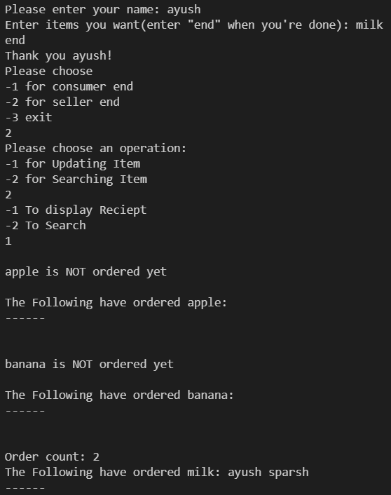

--- Welcome to Grocery Management System ---
--- Made By SPARSH GUPTA ---

To Compile the code :-

         g++ Suffix_tree.c PatternSearch.c  main.cpp bloom.cpp BK_Tree.cpp

The Project has 2 Ends

          Buyer End                                             Seller End
          This is where the buyer enter's his/her name          This is where the Seller adds the items and can search the order List
          along with the items needed.                          along with Full Reciept
          Features:                                             Features:
          -Auto Correct (using BK-Tree)                         -Unique Item List (using Bloom Filter)
                                                                -Fast Search (using Suffix Tree)

Warning :-

-After each Item name entered by buyer press Enter.

-Dont Use Items which are subset of one another.

-Don't use names longer than 99 characters or less than 1.

High level Architecture

Suffix Trees (Suffix_tree.c/h, PatternSearch.c/h):
Implements Ukkonen's algorithm for linear-time suffix tree construction
Used for fast pattern searching in order receipts
Allows O(m) time complexity for finding all occurrences of items in orders

BK Trees (BK_Tree.cpp/hpp):
Implements Burkhard-Keller trees for fuzzy string matching
Used for spell-checking/auto-correction of item names
Helps customers find items even if they misspell them
Uses edit distance (Levenshtein distance) for matching

Bloom Filter (bloom.cpp/hpp):
Space-efficient probabilistic data structure
Uses 4 hash functions (h1-h4) to check item uniqueness
Prevents duplicate items in the inventory
Has small false positive rate but no false negatives

some working screenshots

Customer Ordering

Adding items in store, if already present saying probably present

Seller checks the reciepts for users who have purchased

More than 1 users have baught milk

searching how much times the milk is sold.

